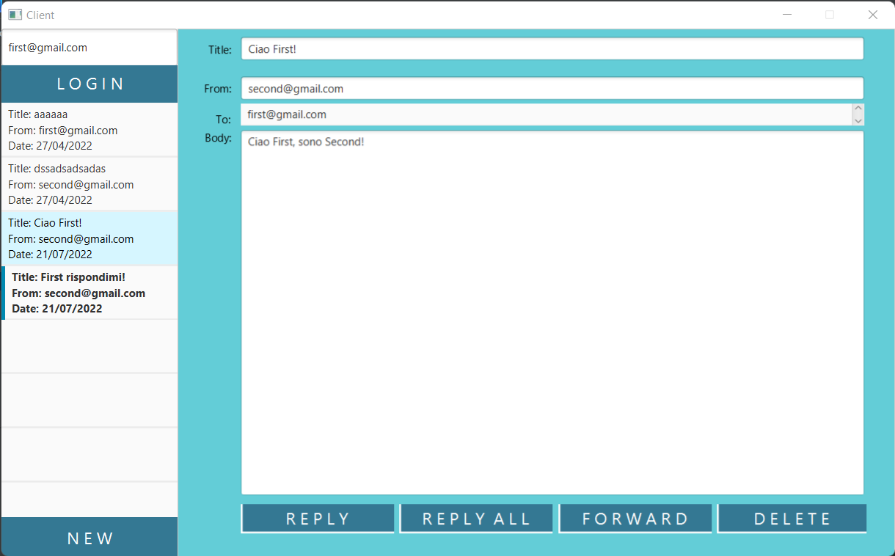
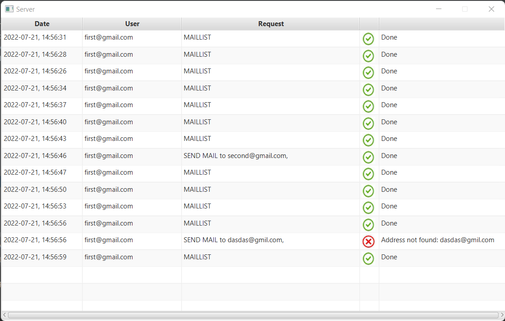

# Mailing System

A little Mailing client-server system, fully developed on Java!

## GUI
Not really good looking ( I'm bad on "frontending" :( )

### Client

### Server

## Architecture
The entire application is divided in 3 modules: `client/`, `server/` and `common/`.
The code inside the first two is structured following the __Model View Controller(MVC)__ design pattern.

In `client/`, 
- __Model__: contains the Mail list of the currently logged in user, recovered from the server
- __Controller(s)__: handles the different GUIs (show current mail list, write new mail, show a single mail)

In `server/`:
- Model (`Mailboxes.java`): handles the Mailboxes of the various users.
- Controller (`ServerLogController.java`): to handle the incoming connections and the interaction with the Logging view

The common/ module contains what must be known either to the client and the server:
- __Mail__: how a mail is composed
- __Request__: how a request is composed
- __Response__: how a response is composed

## Most important classes
- __Requester__: the only class which is responsible to interact with the server, by forging properly formatted Requests and handling the Responses. The multithreaded aspect is handled by using the `concurrent` module offered by __JavaFX__ (`ScheduledService`, `Service` and `Task`).
- __Mailboxes__: holds the core of the server side application, particularly enforcing encapsulation by hiding the `Mailbox.java` class

## Pattern Used
- Model View Controller (MVC)
- Observer-Observable
- Singleton

## Technologies used
- JavaFX
- OpenCSV
- SceneBuilder

